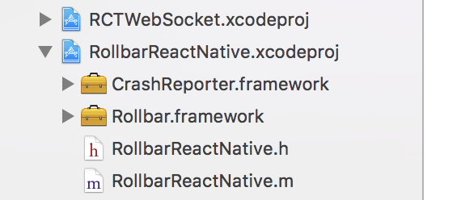

# ALPHA RELEASE

This library is currently under heavy development, however it should be usable
and therefore please [file an issue](https://github.com/rollbar/rollbar-react-native/issues)
if you have any problems working with this library.

# rollbar-react-native

## Getting started

Integrating this library with your React Native codebase requires the following steps:


1. Install the package from NPM

```
$ npm install rollbar-react-native --save
```

or

```
$ yarn add rollbar-react-native
```

2. Link the native modules with the underlying project:

```
$ react-native link rollbar-react-native
```

3. For iOS, download the Rollbar iOS Framework
   [here](https://github.com/rollbar/rollbar-ios/releases/download/v1.0.0-alpha5/Rollbar.zip). Extract this
   zip file somewhere. You will need it for the next couple steps.

4. Open the underlying Xcode project for your app:

```
$ open ios/MyAwesomeApp.xcodeproj
```

5. Drag the framework from the extracted zip file to be part of the `RollbarReactNative` project:



We recommend checking the box that says "Copy items if needed". If you are managing your vendored
dependencies in some other way where you do not want to check that box, then I presume you know what
you are doing.

### Cocoapods

We currently do not recommend using Cocoapods for integrating with Rollbar. This is being worked on,
but at the moment the following instructions may or may not work.

If you are using Cocoapods, then you need to add the following to your pod file:

```
pod 'React', path: '../node_modules/react-native'
pod 'RollbarReactNative', path: '../node_modules/rollbar-react-native/ios'
```

and depending on your version of React Native, you will also need:

```
pod 'yoga', path: '../node_modules/react-native/ReactCommon/yoga'
```

Then perform a `pod install`.

You also need to ensure the static library is linked with your app in the generated workspace like
all other Cocoapods dependencies.

## Configuration

### Javascript

In both `index.ios.js` and `index.android.js` you need to instantiate a Rollbar Client:

```js
import { Client } from 'rollbar-react-native'
const rollbar = new Client('POST_CLIENT_ITEM_ACCESS_TOKEN');
```

For more configuration options, construct an instance of the `Configuration` class:

```js
import { Client, Configuration } from 'rollbar-react-native'
const config = new Configuration('POST_CLIENT_ITEM_ACCESS_TOKEN', {
  endpoint: 'https://api.rollbar.com/api/1/item/',
  logLevel: 'info'
});
const rollbar = new Client(config);
```

The Configuration class is still a work in progress, but should eventually capture all of the
configuration options available for https://github.com/rollbar/rollbar.js/

The Javascript API consists of the logging methods:

```js
rollbar.log(error|message, extra, callback)
rollbar.debug(error|message, extra, callback)
rollbar.info(error|message, extra, callback)
rollbar.warning(error|message, extra, callback)
rollbar.error(error|message, extra, callback)
rollbar.critical(error|message, extra, callback)
```

As well as two methods for dealing with identifying users:

```js
rollbar.setPerson(id, name, email)
rollbar.clearPerson()
```

#### Source Maps

Mapping production React Native JavaScript code to your source files is slightly more
complicated than traditional JavaScript environments. This is due to the fact that iOS and Android
generate different JavaScript bundles, and therefore different stack traces, which need separate
source maps.

You can enable source maps to correctly identify the environment by using the `code_version` to signal
which source map to use. Please note that `code_version` must be nested under the `client` and `javascript` keys in order to work for source mapping.

```js
new Configuration('POST_CLIENT_ITEM_ACCESS_TOKEN', {
  ...
  payload: {
    client: {
      javascript: {
        source_map_enabled: true,
        code_version: 'insert_code_version_here.ios',
      }
    }
  }
});
```

Be sure to specify the code version when you upload the sourcemap. For example, via curl:

```
curl https://api.rollbar.com/api/1/sourcemap \
  -F access_token=ACCESS_TOKEN_HERE \
  -F version=insert_code_version_here.ios \
  -F minified_url=http://reactnativehost/main.jsbundle \
  -F source_map=@sourcemap.ios.js \
  -F index.ios.js=@index.ios.js
```

Source maps use file names for mapping minified symbols to symbols contained in your
original source code. Due to the nature of the JavaScript environment that your code runs in on a
mobile device using React Native, these file names are a bit strange. Rollbar automatically rewrites these
file names to be `http://reactnativehost/<regular file path>`. This allows you to use the
`minified_url` with the fake protocol and host of `http://reactnativehost` to specify your minified
JavaScript code.

Generating stack traces for React Native is an under-documented part of the
pipeline. Below are the commands you can use to generate conforming source maps for iOS and
Android.

iOS:

```
react-native bundle --platform ios --entry-file index.ios.js --dev false --bundle-output
ios/main.jsbundle --assets-dest ios --sourcemap-output sourcemap.ios.js --sourcemap-sources-root ./
```

Android:

```
react-native bundle --platform android --dev false --entry-file index.android.js --bundle-output
android/index.android.bundle --assets-dest android/app/src/main/res/ --sourcemap-output
sourcemap.android.js --sourcemap-sources-root ./
```

### iOS

In `AppDelegate.m` you need to import `RollbarReactNative`

```objc
#import <RollbarReactNative/RollbarReactNative.h>
```

and initialize it

```objc
- (BOOL)application:(UIApplication *)application didFinishLaunchingWithOptions:(NSDictionary*)launchOptions
{
  [RollbarReactNative initWithAccessToken:@"POST_CLIENT_ITEM_ACCESS_TOKEN"];
  ...
}
```

The interface for `RollbarReactNative` in native iOS code is the same as
https://github.com/rollbar/rollbar-ios. Crashes in native code will be reported automatically on the
next app launch.

### Android

We require minSdkVersion of at least 19 be set in your app/build.gradle file.

In `MainApplication.java` you need to import `RollbarReactNative`

```java
import com.rollbar.RollbarReactNative;
```

and initialize it

```java
@Override
public void onCreate() {
  super.onCreate();
  RollbarReactNative.init(this, "POST_CLIENT_ITEM_ACCESS_TOKEN", "production");
  ...
}
```

The interface for `RollbarReactNative` in native Android code is the same as the rollbar-android
part of https://github.com/rollbar/rollbar-java. Crashes in native code will be reported
automatically on the next app launch.
